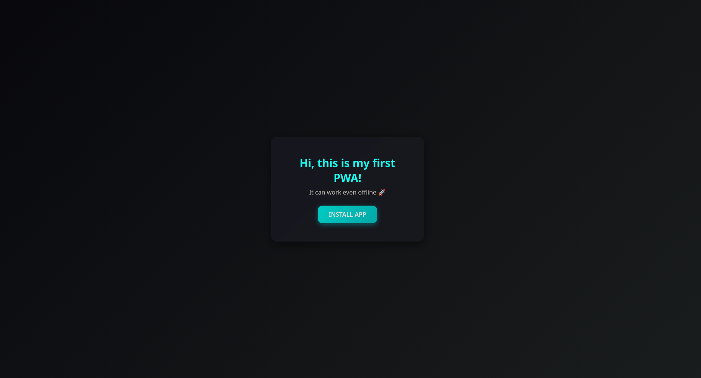

# 🌐 My PWA — Progressive Web App

> 🚀 **Modern, offline-ready web app built with Vite + PWA plugin**

---

## ✨ Features

- ⚡️ **Fast and lightweight** — powered by [Vite](https://vitejs.dev/)
- 📱 **Installable PWA** — works offline and can be added to the home screen
- 🔒 **Secure by default** — served over HTTPS (via GitHub Pages)
- 🎨 **Modern UI** — inspired by ChatGPT dark theme
- 🧠 **Auto-updates** — thanks to `registerType: 'autoUpdate'`
- 🧩 **Multi-page** setup (`index.html`, `install.html`)

---

## 📁 Project structure

my-pwa/
├── index.html # Main page
├── install.html # Installation page
├── src/
│ ├── main.js # App logic
│ ├── install.js # PWA install logic
│ └── styles/
│ ├── base.css # Main style (ChatGPT-like dark theme)
│ └── install.css # Install page styles
├── icons/ # App icons
├── manifest.webmanifest # PWA manifest
├── vite.config.js # Vite + PWA configuration
└── package.json

---

## 🛠️ Tech stack

| Technology | Purpose |
|-------------|----------|
| ⚡️ **Vite** | Frontend bundler for super-fast builds |
| 🔥 **vite-plugin-pwa** | Generates Service Worker and manifest |
| 💅 **CSS** | Custom responsive design |
| ☁️ **GitHub Pages** | Hosting with HTTPS support |

---

📱 Installation (PWA)

Open https://kod0ri.github.io/my-pwa/

---

💙 Author

Developed with ❤️ by @kod0ri
